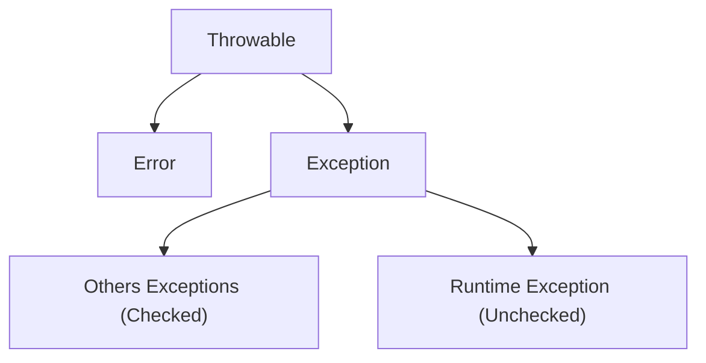

# Programação Orientada a Objetos
## Associação
### Estrutural - relacionado as características(atributos)
- Composição: a parte só pode existir com o todo
- Agregação: a parte pode existir sem o todo
### Comportamental - relacionado ao comportamento(métodos)
- Dependência: depende de receber o objeto(Ex: receber um objeto por parâmetro)

# Tratamento de Exceções em Java
## Throwable
### Error (lançados pela JVM)
-  Não são tratáveis(Ex: falta de memória).
### RuntimeException (Unchecked Exception)
- Não precisa necessariamente ser tratada.
### Resto da Exception (Checked Exception)
- Precisam ser tratadas.

